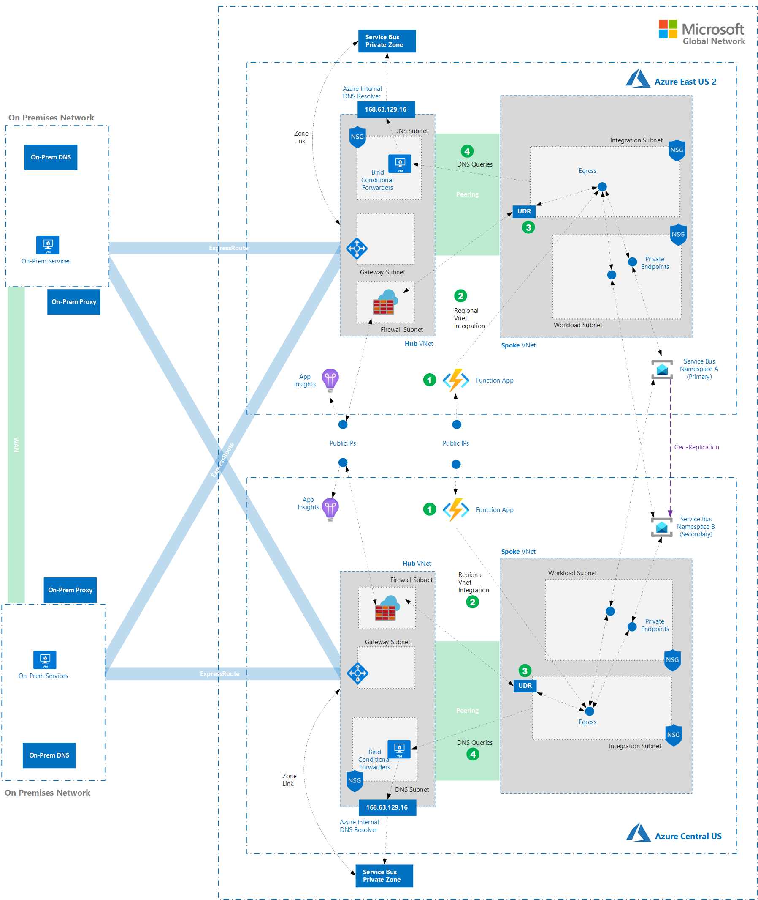

# Azure Cosmos DB Account Multi Region Pattern
## Architecture and Composable Deployment Code
### Implementation

This guide assumes that you are deploying your solution into a networking environment with the following characteristics:

  Azure Cosmos DB architecture.   

- Azure Cosmos DB can be deployed to one or more Azure Regions transparently. For reads, Azure Traffic manager handles routing requests to the requestor's nearest region.

###TODO: Check below to make certain it all appiles
#### Deployment
1. Create a resource group for each region's network resources
	```bash
	az group create --location eastus2 --name network-eastus2-rg  

	az group create --location centralus --name network-centralus-rg
	```
2. Deploy the base VNets and Subnets to both regions ([ARM Template](../components/base-network/azuredeploy.json))
	```bash
	az deployment group create --resource-group network-eastus2-rg --name network-eastus2 --template-file ./../components/base-network/azuredeploy.json --parameters hubVnetPrefix="10.0.0.0/16" firewallSubnetPrefix="10.0.1.0/24" DNSSubnetPrefix="10.0.2.0/24" spokeVnetPrefix="10.1.0.0/16" workloadSubnetPrefix="10.1.2.0/24"

	az deployment group create --resource-group network-centralus-rg --name network-centralus --template-file ./../components/base-network/azuredeploy.json --parameters hubVnetPrefix="10.2.0.0/16" firewallSubnetPrefix="10.2.1.0/24" DNSSubnetPrefix="10.2.2.0/24" spokeVnetPrefix="10.3.0.0/16" workloadSubnetPrefix="10.3.2.0/24"
	
	```
3. Deploy and configure Azure Firewall in both regions ([ARM Template](../components/firewall/azuredeploy.json))
	```bash
	az deployment group create --resource-group network-eastus2-rg --name firewall-eastus2 --template-file ./../components/firewall/azuredeploy.json --parameters  networkResourceGroup=network-eastus2-rg vnetName=hub-vnet subnetName=AzureFirewallSubnet
	
	az deployment group create --resource-group network-centralus-rg --name firewall-centralus --template-file ./../components/firewall/azuredeploy.json --parameters networkResourceGroup=network-centralus-rg vnetName=hub-vnet subnetName=AzureFirewallSubnet
	```
4. Deploy BIND DNS forwarders in both regions ([ARM Template](../components/bind-forwarder/azuredeploy.json))
	```bash
	az deployment group create --resource-group network-eastus2-rg --name bind-eastus2 --template-file ./../components/bind-forwarder/azuredeploy.json --parameters adminUsername=$userName sshKeyData=$sshKey vnetName=hub-vnet subnetName=DNSSubnet
	
	az deployment group create --resource-group network-centralus-rg --name bind-centralus --template-file ./../components/bind-forwarder/azuredeploy.json --parameters adminUsername=$userName sshKeyData=$sshKey vnetName=hub-vnet subnetName=DNSSubnet
	```

[top ->](#Architecture-and-Composable-Deployment-Code)    
### Azure Cosmo DB
#### Requirements
- Predictable / Consistent Performance
- Direct integration to and accessibility from private networks
- No accessibility from public networks
- Cross Region Replication
#### Implementation
  
The base-level resource for Azure Cosmos DB is an Azure Cosmos DB Account. Accounts contain the entities that we will be working with ( Databases, Containers, Collestions, Documents ).


When creating an account in a single region, there are relatively few decisions needed. The delpoyment requires the name, pricing tier, initial scale and redundancy settings, subscription, resource group, consistency levey and location.

This reference implementation will deploy a SQL API Account. This is the most commonly deployed API and is recommended for most production workloads due to it's flexability and ease of development.    
  
- Create an account in one Azure Region (1)  

###TODO: 2 or 3 Azure Regions
- We'll configure geo-redundancy (2) with the another Azure Region by adding it to the Azure Cosmos DB Account. This replicaiton is at the Azure Comos DB Account level, not at the individual database/container level.


###TODO: Change all below
- The account will be set up in the same region as the Resource Group it is in. 

- Geo Redundancy will be enabled by deploying to specific regions

- RUs at account or Datbase Level?

- Default Consistency level

- Key Vault

### TODO: Make this Cosmos Specific
#### Deployment
1. Create resource groups for our reference workload
	```bash
	# for East resources
	az group create --location eastus2 --name refworkload-eastus2-rg  

	# for Central resources
	az group create --location centralus --name refworkload-centralus-rg
	```
2. Create Private DNS Zone for Service Bus ([ARM Template](../components/service-bus/azuredeploy-privatezone.json))
	```bash
	# for East
	az deployment group create --resource-group refworkload-eastus2-rg --name zone-eastus2 --template-file ./../components/service-bus/azuredeploy-privatezone.json --parameters privateDnsZoneName=privatelink.servicebus.windows.net   

	# for Central
	az deployment group create --resource-group refworkload-centralus-rg --name zone-centralus --template-file ./../components/service-bus/azuredeploy-privatezone.json --parameters privateDnsZoneName=privatelink.servicebus.windows.net 
	```
3. Link the Private DNS Zones ([ARM Template](../components/service-bus/azuredeploy-zonelink.json))
	```bash
	# Link the East Zone to the East DNS Network
	az deployment group create --resource-group refworkload-eastus2-rg --name link-east --template-file ./../components/service-bus/azuredeploy-zonelink.json --parameters privateDnsZoneName=privatelink.servicebus.windows.net vnetName=hub-vnet networkResourceGroup=network-eastus2-rg
	
	# Link the Central Zone to the Central DNS Network
	az deployment group create --resource-group refworkload-centralus-rg --name link-east --template-file ./../components/service-bus/azuredeploy-zonelink.json --parameters privateDnsZoneName=privatelink.servicebus.windows.net vnetName=hub-vnet networkResourceGroup=network-centralus-rg
	```
3. Create the Namespaces ([ARM Template](../components/service-bus/azuredeploy-namespace.json))
	```bash
	# East namespace
	az deployment group create --resource-group refworkload-eastus2-rg --name namespace-eastus2 --template-file ./../components/service-bus/azuredeploy-namespace.json --parameters namespaceName=kskrefns1  

	# Central namespace
	az deployment group create --resource-group refworkload-centralus-rg --name namespace-centralus --template-file ./../components/service-bus/azuredeploy-namespace.json --parameters namespaceName=kskrefns2
	```
2. Enable Private Endpoints (two per region)([ARM Template](../components/service-bus/azuredeploy-privatelink.json))
	```bash
	# Central to Central
	az deployment group create --resource-group refworkload-centralus-rg --name plink-centralcentral --template-file ./../components/service-bus/azuredeploy-privatelink.json --parameters namespaceName=kskrefns2 privateEndpointName=centraltocentral privateDnsZoneName=privatelink.servicebus.windows.net vnetName=spoke-vnet subnetName=workload-subnet networkResourceGroup=network-centralus-rg namespaceResourceGroup=refworkload-centralus-rg primary=true  

	# Central to East
	az deployment group create --resource-group refworkload-centralus-rg --name plink-centraleast --template-file ./../components/service-bus/azuredeploy-privatelink.json --parameters namespaceName=kskrefns1 privateEndpointName=centraltoeast privateDnsZoneName=privatelink.servicebus.windows.net vnetName=spoke-vnet subnetName=workload-subnet networkResourceGroup=network-centralus-rg namespaceResourceGroup=refworkload-eastus2-rg primary=true  

	# East to East
	az deployment group create --resource-group refworkload-eastus2-rg --name plink-easteast --template-file ./../components/service-bus/azuredeploy-privatelink.json --parameters namespaceName=kskrefns1 privateEndpointName=easttoeast privateDnsZoneName=privatelink.servicebus.windows.net vnetName=spoke-vnet subnetName=workload-subnet networkResourceGroup=network-eastus2-rg namespaceResourceGroup=refworkload-eastus2-rg primary=true  

	# East to Central
	az deployment group create --resource-group refworkload-eastus2-rg --name plink-eastcentral --template-file ./../components/service-bus/azuredeploy-privatelink.json --parameters namespaceName=kskrefns2 privateEndpointName=easttocentral privateDnsZoneName=privatelink.servicebus.windows.net vnetName=spoke-vnet subnetName=workload-subnet networkResourceGroup=network-eastus2-rg namespaceResourceGroup=refworkload-centralus-rg primary=true
	```

4. Establish Geo-Redundancy ([ARM Template](../components/service-bus/azuredeploy-georeplication.json))
	```bash
	az deployment group create --resource-group refworkload-eastus2-rg --name link-east --template-file ./../components/service-bus/azuredeploy-georeplication.json --parameters namespaceName=kskrefns1 pairedNamespaceResourceGroup=refworkload-centralus-rg pairedNamespaceName=kskrefns2 aliasName=kskrefns
	```
5. Create a test queue and topic in the primary namespace ([ARM Template](../components/service-bus/azuredeploy-queuestopics.json))
	```bash
	 az deployment group create --resource-group refworkload-eastus2-rg --name link-east --template-file ./../components/service-bus/azuredeploy-queuestopics.json --parameters namespaceName=kskrefns1 queueName=queue1 topicName=topic1
	```

[top ->](#Architecture-and-Composable-Deployment-Code)    

### Azure Functions
#### Requirements
- Support for Java (version 8)
- Support for .NET Core C# (version 3.1)
- Ability to run in multiple regions (East US 2 and Central US)
- Connectivity to Azure and on-premises private networks
- Dynamic scaling based on incoming event load / queue depth
#### Implementation
  
- A function app (1) will be deployed into each region for hosting our producer and consumer functions  

- Both function apps (1) will be configured to leverage regional VNet integration (2) to send all egress traffic from all functions into a newly created integration subnet in each region.  

- A UDR (3) will be created and assigned to the integration subnet such that all traffic destined for the internet will be sent through Azure Firewall in the hub VNet. This will allow us to filter and audit all outbound traffic.  

- The Firewall will be configured to allow traffic to public App Insights endpoints to enable built-in monitoring facilitated by the Azure Functions host running in the Function App.

- DNS settings on the Spoke VNet will be configured such that all DNS queries (4) originating from subnets in the VNet will be sent to our custom DNS forwarders.
#### Deploy Infrastructure
1. Deploy and Configure the Integration Subnet for Regional VNet Integration for both regions ([ARM Template](../components/integration-subnet/azuredeploy.json)) - *Requires Network Perms*
	```bash
	az deployment group create --resource-group network-eastus2-rg --name integration-eastus2 --template-file ./../components/integration-subnet/azuredeploy.json --parameters existingVnetName=spoke-vnet integrationSubnetPrefix="10.1.6.0/24"
	
	az deployment group create --resource-group network-centralus-rg --name integration-centralus --template-file ./../components/integration-subnet/azuredeploy.json --parameters existingVnetName=spoke-vnet integrationSubnetPrefix="10.3.6.0/24"
	```
2. Deploy App Service Plans ([ARM Template](../components/functions/azuredeploy-plan.json))
	```bash
	# East
	az deployment group create --resource-group refworkload-eastus2-rg --name appplan-eastus2 --template-file ./../components/functions/azuredeploy-plan.json --parameters planName="kskrefeastus2"
	
	# Central
	az deployment group create --resource-group refworkload-centralus-rg --name appplan-centralus --template-file ./../components/functions/azuredeploy-plan.json --parameters planName="kskrefcentralus"
	```
3. Deploy the Function App Storage Accounts ([ARM Template](../components/functions/azuredeploy-storage.json))
	```bash
	# East
	az deployment group create --resource-group refworkload-eastus2-rg --name funcstor-eastus2 --template-file ./../components/functions/azuredeploy-storage.json --parameters storageAccountName="kskrefeastus2"
	
	# Central
	az deployment group create --resource-group refworkload-centralus-rg --name funcstor-centralus --template-file ./../components/functions/azuredeploy-storage.json --parameters storageAccountName="kskrefcentralus"
	```
4. Deploy Function Apps ([ARM Template](../components/functions/azuredeploy-app.json)) TODO: Add Storage to template.
	```bash
	# East
	az deployment group create --resource-group refworkload-eastus2-rg --name app-eastus2 --template-file ./../components/functions/azuredeploy-app.json --parameters planName="kskrefeastus2" appName="kskrefeastus2" vnetName=spoke-vnet subnetName=integration-subnet networkResourceGroup=network-eastus2-rg
	
	# Central
	az deployment group create --resource-group refworkload-centralus-rg --name app-centralus --template-file ./../components/functions/azuredeploy-app.json --parameters planName="kskrefcentralus" appName="kskrefcentralus" vnetName=spoke-vnet subnetName=integration-subnet networkResourceGroup=network-centralus-rg
	```
5. Update Function App Config for routing and storage 
	```bash
	```
#### Deploy Reference Function Code
1. TBD
	```bash
	TBD
	```
2. TBD
	```bash
	TBD
	```
3. TBD
	```bash
	TBD
	```
[top ->](#Architecture-and-Composable-Deployment-Code) 
---
> [Back to TOC](../README.md#TOC) 
