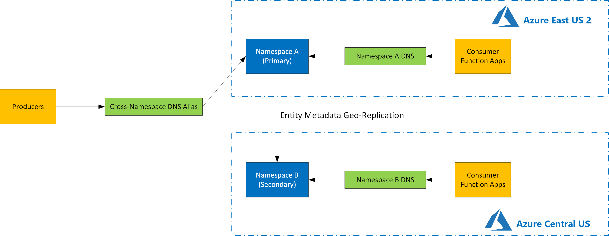
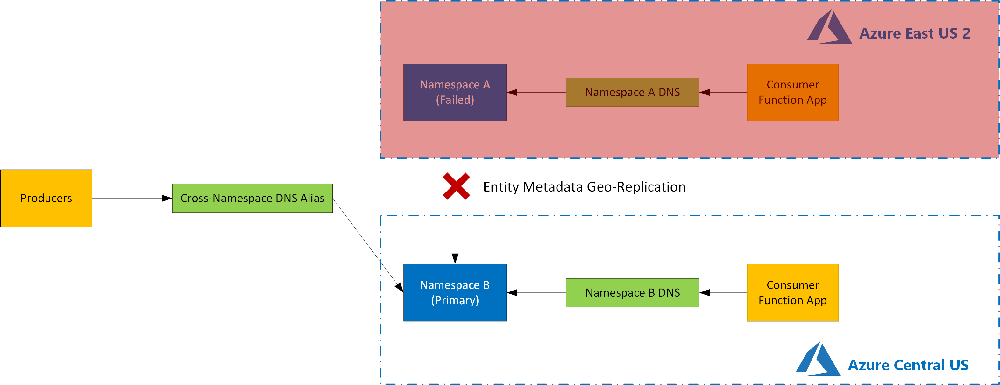

# Producer / Consumer Pattern Using Azure Service Bus and Azure Functions
## Reliability Considerations
### Requirements
- Describe target RPO / RTO.
- Describe FMA.
### High Availability
- Describe Design
- Describe fail-over, fail-back process.
### Disaster Recovery
- Describe Design  
Active Passive / Non-HTTP Trigger Failover
 
Active Passive / Non-HTTP Trigger Failover - Failover
 
- Describe fail-over, fail-back process.
- Describe backup / recovery process.
---
> [Back to TOC](../README.md#TOC)