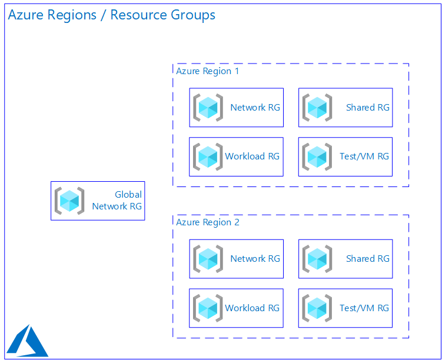
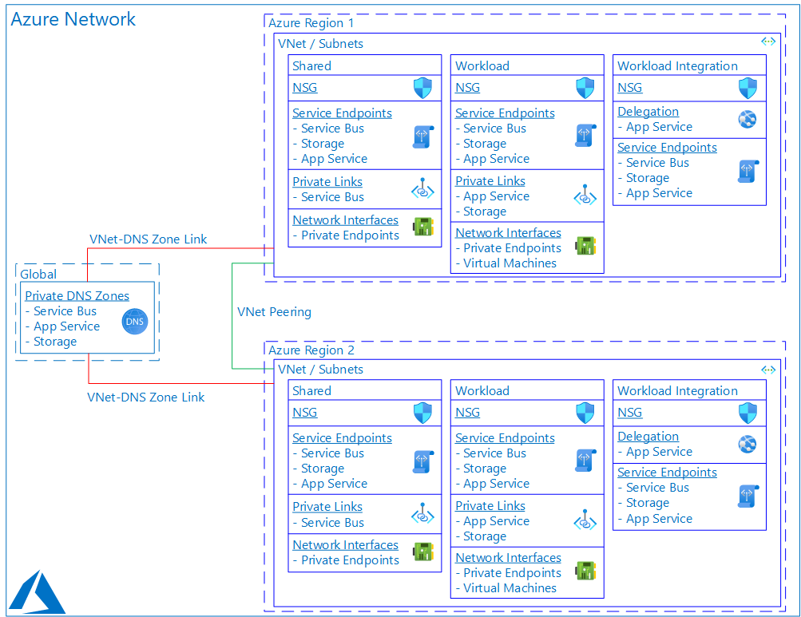

# Producer / Consumer Pattern Using Azure Service Bus and Azure Functions  

## TOC

- [Pre-Requisites](Pre-Requisites)
- [Getting Started](Getting-Started)
- [Architecture](Architecture)

## Pre-Requisites

To work with and deploy this pattern, you will need the following.

- Azure Subscription with sufficient permission to deploy Resource Groups and Resources.
  - This pattern does not use Managed Identities or Service Principals, so you do not need permission to create or modify directory objects.
- Bash shell with latest Azure CLI installed
  - You can use the [Azure Cloud Shell](https://docs.microsoft.com/azure/cloud-shell/overview) in the [Azure Portal](https://docs.microsoft.com/azure/azure-portal/). The Cloud Shell has the Azure CLI and many other tools already installed. You will just need to upload the scripts and ARM template files from this pattern into the Cloud Shell to get started.
  - If you use a local Bash shell, you can install the [Azure CLI](https://docs.microsoft.com/cli/azure/install-azure-cli).
- Your favorite editor for shell scripts and ARM template files. [Visual Studio Code](https://code.visualstudio.com) is free and excellent!

[top ->](#TOC)

## Getting Started

To start working with this pattern, download the files in this folder and its sub-folders, or fork/clone this repository.

First, edit [deploy.variables.sh](./deploy.variables.sh). This shell script defines many variables used by the actual deployment scripts. Each of the other deploy.*.sh scripts calls this script in the same shell, so that variables are set once but can be used in each component script:

```bash
. ./deploy.variables.sh
```

Minimally, edit the first section of deploy.variables.sh, and provide real values for those variables (such as `subscriptionId`) currently stubbed out with a value of `"PROVIDE"`. If you make no other changes, you can deploy all resources now by running [deploy.main.sh](./deploy.main.sh).

In deploy.main.sh, note the use of boolean variables set in deploy.variables.sh to conditionally run each component of the deployment. For example, network resources are only deployed if the variable in question is set to true:

```bash
if $deployNetwork
then
    ./deploy.network.sh
fi
```

[top ->](#TOC)

## Architecture

This pattern has some similarities to [v1](../v1). Please review the README there for foundational understanding.

The motivation for this pattern is to deploy a set of inter-related resources, including a secured network, shared resources such as Azure Service Bus Namespaces, and individual workloads such as Azure Functions which use the shared resources, and run in the same network environment.

The pattern shows how to implement network security for each resource type, so that resources are not publicly addressable or accessible. This is accomplished using Azure Private Link and Private Endpoints, Virtual Networks with Network Security Groups, and per-resource network access restrictions.

Azure Private DNS is used so that resources _within_ the network environment resolve each other using private FQDNs and IP addresses, so that all traffic between components stays on the Azure backbone and uses Private Link connections. Other resources _outside_ the network environment (such as workloads on premise or outside of the VNets in this pattern) will still resolve deployed components by their public FQDNs - i.e. split-horizon DNS. Actual connectivity will be secured as described above.

### Azure Regions and Resource Groups

This pattern splits components into distinct, purpose-oriented Resource Groups (RGs). This supports modular deployments, where network, shared, and workload components may not be deployed at the same time, or may re-use previously deployed components, or may be completed by different people with different levels of Azure permissions.

One RG for global network resources is deployed (regardless of how many Azure Regions are deployed to). Additionally, Resource Groups are deployed into _each_ Azure Region for the following components: Network, Shared (such as Azure Service Bus), Workload (such as Azure Functions), and Testing (such as VMs to work with resources that have network access restrictions).



### Network

For simplicity, this pattern focuses on deployment of the actual workload and shared resources. One Azure Virtual Network (VNet) is deployed in each Azure Region. The regional VNets are peered to each other.

A full, per-region hub-and-spoke architecture is not deployed in this pattern, as v1 explores that and adding hub VNets to this pattern is an additive exercise.

Each VNet contains Subnets for the following purposes: shared resources such as Azure Service Bus Namespaces; workload resources and Private Endpoint Network Interfaces; and Azure Function VNet integration.

This pattern supports designating a distinct Network Security Group (NSG) for each Subnet. For simplicity, the same NSG is used for each Subnet but this is easily adjusted in [deploy.network.sh](./deploy.network.sh).

Additionally, Subnets are configured as follows:

- Service Endpoints are configured to allow connectivity from resources _in_ the subnet _to_ the Service Endpoint's resource type outside the subnet
- Private Links are configured to allow connectivity _to_ Private Endpoints deployed for protected resources
- Network Interfaces are deployed to provide connectivity for Private Endpoints
- Service Delegation is configured for the Workload Integration subnet, to allow the delegated-to service to deploy other components as needed.

The VNets are Peered, so that resources in one VNet can resolve resources in the other VNet and can connect to resources in the other VNet, as allowed by network access restrictions.

Each VNet is also linked to a set of Private DNS Zones, which are globally-deployed resources. This permits resolution of resources protected by Private Endpoints by their internal FQDNs and private IP addresses. Recall that these DNS Zones will only be used by resources in the VNet, since this pattern includes VNet-DNS Zone link deployment, whereas DNS clients outside of these VNets will use public Azure DNS resolution (split-horizon DNS).

This diagram shows the network configuration.



