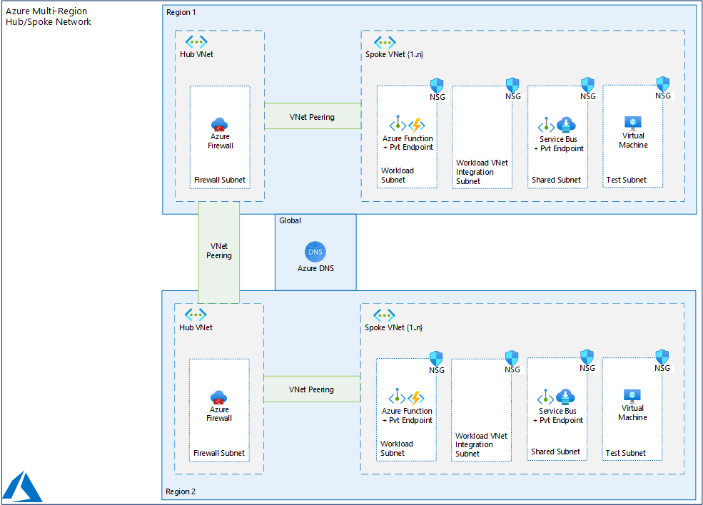

# Producer / Consumer Pattern Using Azure Service Bus and Azure Functions  

## TOC

- [Pre-Requisites](Pre-Requisites)
- [Architecture](Architecture)
  - [Motivation and Goals](Motivation-and-Goals)
  - [Azure Regions and Resource Groups](Azure-Regions-and-Resource-Groups)
  - [Network](Network)
- [Getting Started](Getting-Started)
  - [Preparing to Test](Preparing-to-Test)
  - [Custom VM Images](Custom-VM-Images)
- [Network Security Tests](Network-Security-Tests)
- [Deployment Assets](Deployment-Assets)
  - [Preparation for Production](Preparation-for-Production)

## Pre-Requisites

To work with and deploy this pattern, you will need the following.

- Azure Subscription with sufficient permission to deploy Resource Groups and Resources.
  - This pattern does not use Managed Identities or Service Principals, so you do not need permission to create or modify directory objects.
- Bash shell with latest Azure CLI installed
  - You can use the [Azure Cloud Shell](https://docs.microsoft.com/azure/cloud-shell/overview) in the [Azure Portal](https://docs.microsoft.com/azure/azure-portal/). The Cloud Shell has the Azure CLI and many other tools already installed. You will just need to upload the scripts and ARM template files from this pattern into the Cloud Shell to get started.
  - If you use a local Bash shell, you can install the [Azure CLI](https://docs.microsoft.com/cli/azure/install-azure-cli).
- Your favorite editor for shell scripts and ARM template files. [Visual Studio Code](https://code.visualstudio.com) is free and excellent!

[top ->](#TOC)

## Architecture

This pattern has similarities to [v1](../v1). Please review the README there for foundational understanding.



### Motivation and Goals

The motivation for this pattern is to deploy a set of inter-related resources, including a secured network, shared resources such as Azure Service Bus Namespaces, and individual workloads such as Azure Functions which use the shared resources.

The pattern's goal is to show how to implement network security for each resource type, so that resources are not publicly addressable or accessible but are fully capable of inter-operating. This is accomplished using Azure Private Link and Private Endpoints, Virtual Networks with Network Security Groups, and per-resource network access restrictions.

Azure Private DNS is used so that resources _within_ the network environment resolve each other using private FQDNs and IP addresses, so that all traffic between components stays on the Azure backbone and uses Private Link connections.

Other resources _outside_ the network environment (such as workloads on premise or outside of the VNets in this pattern) will still resolve deployed components by their public FQDNs - i.e. split-horizon DNS. Actual connectivity will be secured as described above.

Azure Service Bus (ASB) Namespaces are deployed to each Azure region. Unlike v1 of this pattern, ASB geo-DR is not used in this pattern, since it enables entity but not message replication. Instead, the ASB Namespaces are left independent, though deployed with similar configuration and initial messaging entities, to enable externally controlled active/active or active/passive messaging patterns.

### Azure Regions and Resource Groups

This pattern splits components into distinct, purpose-oriented Resource Groups (RGs). This supports modular deployments, where network, shared, and workload components may not be deployed at the same time, or may re-use previously deployed components, or may be completed by different people with different levels of Azure permissions.

One RG for global network resources is deployed (regardless of how many Azure Regions are deployed to). Additionally, Resource Groups are deployed into _each_ Azure Region for the following components: Network, Shared (such as Azure Service Bus), Workload (such as Azure Functions), Workload VNet integration (for Azure Functions), and Testing (such as VMs to work with resources that have network access restrictions).

### Network

This pattern deploys a hub-and-spoke network in each Azure region. One hub VNet with an Azure Firewall is deployed into each Azure region. One spoke VNet is deployed into each Azure region. VNet peerings are created between spoke and hub VNets within region, and between hub VNets across Azure regions.

Hub VNets contain Azure Firewall subnets. Spoke VNets contain subnets for the following purposes:

- Shared: shared resources such as Azure Service Bus Namespaces
- Workload: workload resources and Private Endpoint Network Interfaces
- Workload VNet Integration: for Azure Functions workloads, a dedicated subnet so the workload can access Azure resources in the VNet
- Test: for Virtual Machines and other dev/test workloads

This pattern supports designating a distinct Network Security Group (NSG) for each subnet. For simplicity, the same NSG is used for each subnet but this is easily adjusted in [deploy.network.sh](./deploy.network.sh).

Additionally, subnets are configured as follows:

- Service Endpoints are configured to allow connectivity from resources _in_ the subnet _to_ the Service Endpoint's resource type outside the subnet
- Private Links are configured to allow connectivity _to_ Private Endpoints deployed for protected resources
- Network Interfaces are deployed to provide connectivity for Private Endpoints
- Service Delegation is configured for the Workload VNet Integration subnet, to allow the delegated-to service to deploy other components as needed.

Each spoke VNet is also linked to a set of Private DNS Zones, which are globally-deployed resources. This permits resolution of resources protected by Private Endpoints by their internal FQDNs and private IP addresses. Recall that these DNS Zones will only be used by resources in the VNet, since this pattern includes VNet-DNS Zone link deployment, whereas DNS clients outside of these VNets will use public Azure DNS resolution (split-horizon DNS).

[top ->](#TOC)

## Getting Started

To start working with this pattern, download the files in this folder and its sub-folders, or fork/clone this repository.

First, edit [deploy.variables.sh](./deploy.variables.sh). This shell script defines many variables used by the actual deployment scripts. Each of the other deploy.*.sh scripts calls this script in the same shell, so that variables are set once but can be used in each component script:

```bash
. ./deploy.variables.sh
```

Minimally, edit the first section of deploy.variables.sh, and provide real values for those variables currently stubbed out with a value of `"PROVIDE"`. If you make no other changes, you can deploy all resources now by running [deploy.main.sh](./deploy.main.sh).

In deploy.main.sh, note the use of boolean variables set in deploy.variables.sh to conditionally run each component of the deployment. For example, network resources are only deployed if the variable in question is set to true:

```bash
if $deployNetwork
then
    ./deploy.network.sh
fi
```

### Preparing to Test

If you decide to reproduce the network security tests listed below, you will need test environments outside of the deployed VNets to test that access is correctly denied, and test environments inside the VNets to test that access is correctly granted.

`deploy.main.sh` includes a section to conditionally deploy a set of VMs within the VNet for testing:

```bash
if $deployVms
then
  ./deploy.vms.sh
fi
```

Set `$deployVms="true"` in `deploy.variables.sh` to deploy one VM into each VNet.

Set `nsgRuleInbound100Src="(your source IP)"` in `deploy.variables.sh`. This will configure the deployed Network Security Group (NSG) to allow you to access the deployed environment from outside the VNets, including connecting to the VMs to install and use test tools.

The following tools are highly recommended to test connecting to and managing Azure resources:

- [Azure Storage Explorer](https://storageexplorer.com): Connect to and manage Azure Storage accounts and resources
- [Azure Service Bus Explorer](https://github.com/paolosalvatori/ServiceBusExplorer): Connect to, manage, and send/receive messages on Service Bus Namespaces and resources (queues, topics, subscriptions)

### Custom VM Images

For repeated deployments, it may be useful to install and configure required software on the deployed VMs, then generalize each VM and capture a VM image to Azure so that new VMs will be deployed with the required software already installed. This deployment contains support for deploying from such images.

To deploy VMs for testing from custom images, modify `deploy.variables.sh` as follows.

Find the following section. Uncomment the two lines that set the `virtualMachineImageResourceIdLocation1` and `virtualMachineImageResourceIdLocation2` variables. Then replace the `{RESOURCE-GROUP-NAME}` and `{IMAGE-NAME}` placeholders with your values.

```bash
# If deploying VMs from custom images, set here
#virtualMachineImageResourceIdLocation1="/subscriptions/""$subscriptionId""/resourceGroups/{RESOURCE-GROUP-NAME}/providers/Microsoft.Compute/images/{IMAGE-NAME}"
#virtualMachineImageResourceIdLocation2="/subscriptions/""$subscriptionId""/resourceGroups/{RESOURCE-GROUP-NAME}/providers/Microsoft.Compute/images/{IMAGE-NAME}"
```

References
[Create a managed image of a generalized VM in Azure](https://docs.microsoft.com/azure/virtual-machines/windows/capture-image-resource)
[Create a VM from a managed image](https://docs.microsoft.com/azure/virtual-machines/windows/create-vm-generalized-managed)

[top ->](#TOC)

## Network Security Tests

The following tests capture typical network security requirements and were carried out to validate the network security of this deployment.

Test | Tool | Expected Result | Actual Result = Expected? | Notes
---- | ---- | --------------- | :-----------------------: | -----
Access Region 1 Workload Storage Account from Outside VNets | Azure Storage Explorer on VM outside VNets | Deny List or Access Blobs, File Shares | Yes | Workload Storage Accounts have Private Endpoint AND VNet Access Restrictions. Access from outside the allowed VNets should be denied.
Access Region 2 Workload Storage Account from Outside VNets | Azure Storage Explorer on VM outside VNets | Deny List or Access Blobs, File Shares | Yes | Workload Storage Accounts have Private Endpoint AND VNet Access Restrictions. Access from outside the allowed VNets should be denied.
Access Region 1 Workload Storage Account from Region 1 Spoke VNet | Azure Storage Explorer on VM in Region 1 Spoke VNet | Allow List or Access Blobs, File Shares | Yes | Workload Storage Accounts configured with Private Endpoints and VNet access restrictions. Access from same Spoke VNet is allowed.
Access Region 2 Workload Storage Account from Region 1 Spoke VNet | Azure Storage Explorer on VM in Region 1 Spoke VNet | Deny List or Access Blobs, File Shares | Yes | Workload Storage Accounts configured with Private Endpoints and VNet access restrictions. Access from same Spoke VNet is allowed. Access from other VNets, including other Spoke VNet, is not allowed and will be denied. Also, access from other Spoke VNet would have to traverse Spoke - Hub - Hub - Spoke VNets. Spoke VNets are not peered to each other, and VNet peerings are non-transitive, which is why access from a Spoke VNet in one region to a resource in a Spoke VNet in the other region will fail in the default Hub/Spoke configuration.
Access Region 1 Workload Storage Account from Region 2 Spoke VNet | Azure Storage Explorer on VM in Region 2 Spoke VNet | Deny List or Access Blobs, File Shares | Yes | Workload Storage Accounts configured with Private Endpoints and VNet access restrictions. Access from same Spoke VNet is allowed. Access from other VNets, including other Spoke VNet, is not allowed and will be denied. Also, access from other Spoke VNet would have to traverse Spoke - Hub - Hub - Spoke VNets. Spoke VNets are not peered to each other, and VNet peerings are non-transitive, which is why access from a Spoke VNet in one region to a resource in a Spoke VNet in the other region will fail in the default Hub/Spoke configuration.
Access Region 2 Workload Storage Account from Region 2 Spoke VNet | Azure Storage Explorer on VM in Region 2 Spoke VNet | Allow List or Access Blobs, File Shares | Yes | Workload Storage Accounts configured with Private Endpoints and VNet access restrictions. Access from same Spoke VNet is allowed.
Access Service Bus Namespace in Region 1 from Outside VNets | Azure Service Bus Explorer | Deny Access to Namespace and Objects (Queues, Topics, Subscriptions) | Yes | Service Bus Namespaces configured for VNet access restriction and Private Endpoint
Access Service Bus Namespace in Region 2 from Outside VNets | Azure Service Bus Explorer | Deny Access to Namespace and Objects (Queues, Topics, Subscriptions) | Yes | Service Bus Namespaces configured for VNet access restriction and Private Endpoint
Access Service Bus Namespace in Region 1 from VNet in Region 1 | Azure Service Bus Explorer on VM in Region 1 | Allow Access to Namespace and Objects, including Object Management and Counts | Yes | Service Bus Namespaces configured for VNet access restriction and Private Endpoint, which allows peered VNet access
Access Service Bus Namespace in Region 2 from VNet in Region 1 | Azure Service Bus Explorer on VM in Region 1 | Deny Access to Namespace and Objects, including Object Management and Counts | Yes | Service Bus Namespaces configured for VNet access restriction and Private Endpoint. Access from other Spoke VNet would have to traverse Spoke - Hub - Hub - Spoke VNets. Spoke VNets are not peered to each other, and VNet peerings are non-transitive, which is why access from a Spoke VNet in one region to a resource in a Spoke VNet in the other region will fail in the default Hub/Spoke configuration.
Access Service Bus Namespace in Region 1 from VNet in Region 2 | Azure Service Bus Explorer on VM in Region 2 | Allow Access to Namespace and Objects, including Object Management and Counts | Yes | Service Bus Namespaces configured for VNet access restriction and Private Endpoint, which allows peered VNet access. Access from other Spoke VNet would have to traverse Spoke - Hub - Hub - Spoke VNets. Spoke VNets are not peered to each other, and VNet peerings are non-transitive, which is why access from a Spoke VNet in one region to a resource in a Spoke VNet in the other region will fail in the default Hub/Spoke configuration.
Access Service Bus Namespace in Region 2 from VNet in Region 2 | Azure Service Bus Explorer on VM in Region 2 | Allow Access to Namespace and Objects, including Object Management and Counts | Yes | Service Bus Namespaces configured for VNet access restriction and Private Endpoint, which allows peered VNet access
Access Workload Advanced Tools (Function App / Kudu) in Region 1 from Outside VNets | Browser to Azure Portal, Function App, Advanced Tools | Deny Access with Error 403 | Yes | Workload Function Apps configured for VNet access restriction and Private Endpoint, with same configuration applied to Function App Advanced Tools (Kudu).
Access Workload Advanced Tools (Function App / Kudu) in Region 2 from Outside VNets | Browser to Azure Portal, Function App, Advanced Tools | Deny Access with Error 403 | Yes | Workload Function Apps configured for VNet access restriction and Private Endpoint, with same configuration applied to Function App Advanced Tools (Kudu).
Access Workload Advanced Tools (Function App / Kudu) in Region 1 from VNet in Region 1 | Browser to Azure Portal, Function App, Advanced Tools on VM in Region 1 | Allow Access | Yes | Workload Function Apps configured for Private Endpoint and VNet access restriction to same Spoke VNet. Same configuration applied to Function App Advanced Tools (Kudu).
Access Workload Advanced Tools (Function App / Kudu) in Region 2 from VNet in Region 1 | Browser to Azure Portal, Function App, Advanced Tools on VM in Region 1 | Deny Access | Yes | Workload Function Apps configured for Private Endpoint and VNet access restriction to same Spoke VNet. Same configuration applied to Function App Advanced Tools (Kudu). Access from other Spoke VNet would have to traverse Spoke - Hub - Hub - Spoke VNets. Spoke VNets are not peered to each other, and VNet peerings are non-transitive, which is why access from a Spoke VNet in one region to a resource in a Spoke VNet in the other region will fail in the default Hub/Spoke configuration.
Access Workload Advanced Tools (Function App / Kudu) in Region 1 from VNet in Region 2 | Browser to Azure Portal, Function App, Advanced Tools on VM in Region 2 | Deny Access | Yes | Workload Function Apps configured for Private Endpoint and VNet access restriction to same Spoke VNet. Same configuration applied to Function App Advanced Tools (Kudu). Access from other Spoke VNet would have to traverse Spoke - Hub - Hub - Spoke VNets. Spoke VNets are not peered to each other, and VNet peerings are non-transitive, which is why access from a Spoke VNet in one region to a resource in a Spoke VNet in the other region will fail in the default Hub/Spoke configuration.
Access Workload Advanced Tools (Function App / Kudu) in Region 2 from VNet in Region 2 | Browser to Azure Portal, Function App, Advanced Tools on VM in Region 2 | Allow Access | Yes |  Workload Function Apps configured for Private Endpoint and VNet access restriction to same Spoke VNet. Same configuration applied to Function App Advanced Tools (Kudu).
Create Function in Region 1 from Outside VNets in Azure Portal | Browser to Azure Portal, Function App. Add to existing App Service Plan. Configure for Private Endpoint and VNet access restriction. | Allow | Yes | Resource _management_ is allowed, though resource _access_ is not due to network restrictions.
Create Function in Region 2 from Outside VNets in Azure Portal | Browser to Azure Portal, Function App. Add to existing App Service Plan. Configure for Private Endpoint and VNet access restriction. | Allow | Yes | Resource _management_ is allowed, though resource _access_ is not due to network restrictions.
Create Function in Region 1 from VNet in Region 1 in Azure Portal | Browser to Azure Portal, Function App. Add to existing App Service Plan. Configure for Private Endpoint and VNet access restriction. | Allow | Yes | Resource management is allowed.
Create Function in Region 2 from VNet in Region 1 in Azure Portal | Browser to Azure Portal, Function App. Add to existing App Service Plan. Configure for Private Endpoint and VNet access restriction. | Allow | Yes | Resource _management_ is allowed, though resource _access_ is not due to network restrictions.
Create Function in Region 1 from VNet in Region 2 in Azure Portal | Browser to Azure Portal, Function App. Add to existing App Service Plan. Configure for Private Endpoint and VNet access restriction. | Allow | Yes | Resource _management_ is allowed, though resource _access_ is not due to network restrictions.
Create Function in Region 2 from VNet in Region 2 in Azure Portal | Browser to Azure Portal, Function App. Add to existing App Service Plan. Configure for Private Endpoint and VNet access restriction. | Allow | Yes | Resource management is allowed.
Invoke HTTP Trigger Workload Function in Region 1 from Outside VNets | Browser to Function URL | Deny Access with Error 403 | Yes | Resource _management_ is allowed, though resource _access_ is not due to network restrictions.
Invoke HTTP Trigger Workload Function in Region 2 from Outside VNets | Browser to Function URL | Deny Access with Error 403 | Yes | Resource _management_ is allowed, though resource _access_ is not due to network restrictions.
Invoke HTTP Trigger Workload Function in Region 1 from Spoke VNet in Region 1 | Browser to Function URL | Allow Access | Yes | Resource access is allowed.
Invoke HTTP Trigger Workload Function in Region 2 from Spoke VNet in Region 1 | Browser to Function URL | Deny Access | Yes | Resource access is not allowed due to network restrictions. Access from other Spoke VNet would have to traverse Spoke - Hub - Hub - Spoke VNets. Spoke VNets are not peered to each other, and VNet peerings are non-transitive, which is why access from a Spoke VNet in one region to a resource in a Spoke VNet in the other region will fail in the default Hub/Spoke configuration.
Invoke HTTP Trigger Workload Function in Region 1 from Spoke VNet in Region 2 | Browser to Function URL | Deny Access | Yes | Resource access is not allowed due to network restrictions. Access from other Spoke VNet would have to traverse Spoke - Hub - Hub - Spoke VNets. Spoke VNets are not peered to each other, and VNet peerings are non-transitive, which is why access from a Spoke VNet in one region to a resource in a Spoke VNet in the other region will fail in the default Hub/Spoke configuration.
Invoke HTTP Trigger Workload Function in Region 2 from Spoke VNet in Region 2 | Browser to Function URL | Allow Access | Yes | Resource access is allowed.
Access Workload Function Log in Region 1 from Outside VNets in Azure Portal | Browser to Azure Portal, Function App, Function Log | Deny Access | Yes | Resource access not allowed due to network restrictions.
Access Workload Function Log in Region 2 from Outside VNets in Azure Portal | Browser to Azure Portal, Function App, Function Log | Deny Access | Yes | Resource access not allowed due to network restrictions.
Access Workload Function Log in Region 1 from VNet in Region 1 in Azure Portal | Browser to Azure Portal, Function App, Function Log on VM in Region 1 | Allow Access | Yes | Workload Function Apps configured for Private Endpoint and VNet access restriction to same Spoke VNet.
Access Workload Function Log in Region 2 from VNet in Region 1 in Azure Portal | Browser to Azure Portal, Function App, Function Log on VM in Region 1 | Deny Access | Yes | Workload Function Apps configured for Private Endpoint and VNet access restriction to same Spoke VNet. Access from other Spoke VNet would have to traverse Spoke - Hub - Hub - Spoke VNets. Spoke VNets are not peered to each other, and VNet peerings are non-transitive, which is why access from a Spoke VNet in one region to a resource in a Spoke VNet in the other region will fail in the default Hub/Spoke configuration.
Access Workload Function Log in Region 1 from VNet in Region 2 in Azure Portal | Browser to Azure Portal, Function App, Function Log on VM in Region 2 | Deny Access | Yes | Workload Function Apps configured for Private Endpoint and VNet access restriction to same Spoke VNet. Access from other Spoke VNet would have to traverse Spoke - Hub - Hub - Spoke VNets. Spoke VNets are not peered to each other, and VNet peerings are non-transitive, which is why access from a Spoke VNet in one region to a resource in a Spoke VNet in the other region will fail in the default Hub/Spoke configuration.
Access Workload Function Log in Region 2 from VNet in Region 2 in Azure Portal | Browser to Azure Portal, Function App, Function Log on VM in Region 2 | Allow Access | Yes | Workload Function Apps configured for Private Endpoint and VNet access restriction to same Spoke VNet.
Workload Function in Region 1 triggered by ASB Queue in Region 1 | ASB Explorer on VM in Region 1 to send messages and monitor counts. Browser on VM in Region 1 to monitor Function Log. | Function in Region 1 triggered when message sent to ASB Queue in Region 1 | Yes | ASB Namespace VNet access rules only allow same Spoke VNet/subnets access.
Workload Function in Region 1 triggered by ASB Topic/Subscription in Region 1 | ASB Explorer on VM in Region 1 to send messages and monitor counts. Browser on VM in Region 1 to monitor Function Log. | Function in Region 1 triggered when message sent to ASB Topic in Region 1 | Yes | ASB Namespace VNet access rules only allow same Spoke VNet/subnets access.
Workload Function in Region 1 triggered by ASB Queue in Region 2 | ASB Explorer on VM in Region 2 to send messages and monitor counts. Browser on VM in Region 1 to monitor Function Log. | Function in Region 1 NOT triggered when message sent to ASB Queue in Region 2 | Yes | ASB Namespace VNet access rules only allow same Spoke VNet/subnets access.
Workload Function in Region 1 triggered by ASB Topic/Subscription in Region 2 | ASB Explorer on VM in Region 2 to send messages and monitor counts. Browser on VM in Region 1 to monitor Function Log. | Function in Region 1 NOT triggered when message sent to ASB Topic in Region 2 | Yes | ASB Namespace VNet access rules only allow same Spoke VNet/subnets access.
Workload Function in Region 2 triggered by ASB Queue in Region 1 | ASB Explorer on VM in Region 1 to send messages and monitor counts. Browser on VM in Region 2 to monitor Function Log. | Function in Region 2 NOT triggered when message sent to ASB Queue in Region 1 | Yes | ASB Namespace VNet access rules only allow same Spoke VNet/subnets access.
Workload Function in Region 2 triggered by ASB Topic/Subscription in Region 1 | ASB Explorer on VM in Region 1 to send messages and monitor counts. Browser on VM in Region 2 to monitor Function Log. | Function in Region 2 NOT triggered when message sent to ASB Topic in Region 1 | Yes | ASB Namespace VNet access rules only allow same Spoke VNet/subnets access.
Workload Function in Region 2 triggered by ASB Queue in Region 2 | ASB Explorer on VM in Region 2 to send messages and monitor counts. Browser on VM in Region 2 to monitor Function Log. | Function in Region 2 triggered when message sent to ASB Queue in Region 2 | Yes | ASB Namespace VNet access rules only allow same Spoke VNet/subnets access.
Workload Function in Region 2 triggered by ASB Topic/Subscription in Region 2 | ASB Explorer on VM in Region 2 to send messages and monitor counts. Browser on VM in Region 2 to monitor Function Log. | Function in Region 2 triggered when message sent to ASB Topic in Region 2 | Yes | ASB Namespace VNet access rules only allow same Spoke VNet/subnets access.

## Deployment Assets

This pattern uses the following deployment technologies and assets:

- Bash shell scripts: these can be run in any bash shell, including [WSL2 on Windows 10](https://docs.microsoft.com/windows/wsl/about) and [Azure Cloud Shell](https://docs.microsoft.com/azure/cloud-shell/overview).
- [Azure Resource Manager (ARM) Templates](https://docs.microsoft.com/azure/templates/). 
- [Azure Command Line Interface (CLI)](https://docs.microsoft.com/cli/azure/reference-index) commands. Azure Resource Groups are created directly using CLI command [`az group create`](https://docs.microsoft.com/cli/azure/group#az_group_create). All other Azure resources are created by deploying from ARM templates using CLI command [`az deployment group create`](https://docs.microsoft.com/cli/azure/deployment/group#az_deployment_group_create).

The [ARM templates in this deployment](./template/) are componentized to permit flexible re-use in different combinations, with a deployment script or other automation controller artifact controlling configuration and order of deployment. That is, each ARM template covers the fewest Azure resources possible, with the design goal being one resource type in one ARM template file.
